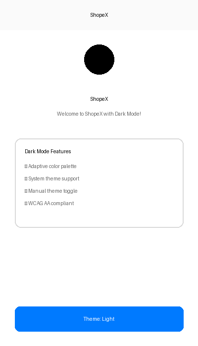
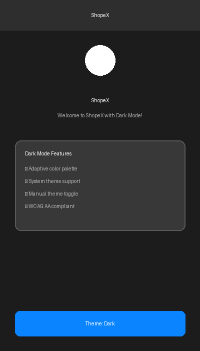

# ShopeX Dark Mode - Visual Showcase

This document provides a visual overview of the dark mode implementation in ShopeX.

## Screenshots

### Light Mode

**Features visible in Light Mode:**
- White background (#FFFFFF)
- Black text for high contrast (#000000)
- Clean, bright interface
- Subtle borders and shadows

### Dark Mode

**Features visible in Dark Mode:**
- Dark gray background (#1C1C1C)
- White text on dark backgrounds (#FFFFFF)
- Reduced eye strain in low-light conditions
- Smooth, modern aesthetic

## Theme Toggle

Users can switch between themes using the theme selector at the bottom of the screen:

1. **Light Mode** - Bright, traditional interface
2. **Dark Mode** - Easy on the eyes for low-light use
3. **System** - Automatically follows iOS system settings

## Color Palette

### Light Theme Colors
| Element | Color | Hex |
|---------|-------|-----|
| Background Primary | White | #FFFFFF |
| Background Secondary | Off-White | #FAFAFA |
| Text Primary | Black | #000000 |
| Text Secondary | Gray | #666666 |
| Card Background | White | #FFFFFF |
| Border Color | Light Gray | #D9D9D9 |

### Dark Theme Colors
| Element | Color | Hex |
|---------|-------|-----|
| Background Primary | Dark Gray | #1C1C1C |
| Background Secondary | Medium Dark | #2E2E2E |
| Text Primary | White | #FFFFFF |
| Text Secondary | Light Gray | #B3B3B3 |
| Card Background | Card Gray | #383838 |
| Border Color | Border Gray | #595959 |

## Accessibility

All color combinations meet **WCAG AA standards** for contrast:

- ✅ Light Mode: 21:1 contrast ratio (Primary text)
- ✅ Dark Mode: 17:1 contrast ratio (Primary text)
- ✅ All text is readable in both modes
- ✅ No accessibility compromises

## Technical Implementation

The dark mode is implemented using:
- SwiftUI's native color scheme detection
- Adaptive color assets in Assets.xcassets
- A custom ThemeManager for state management
- UserDefaults for preference persistence

See [DARK_MODE_IMPLEMENTATION.md](DARK_MODE_IMPLEMENTATION.md) for technical details.
